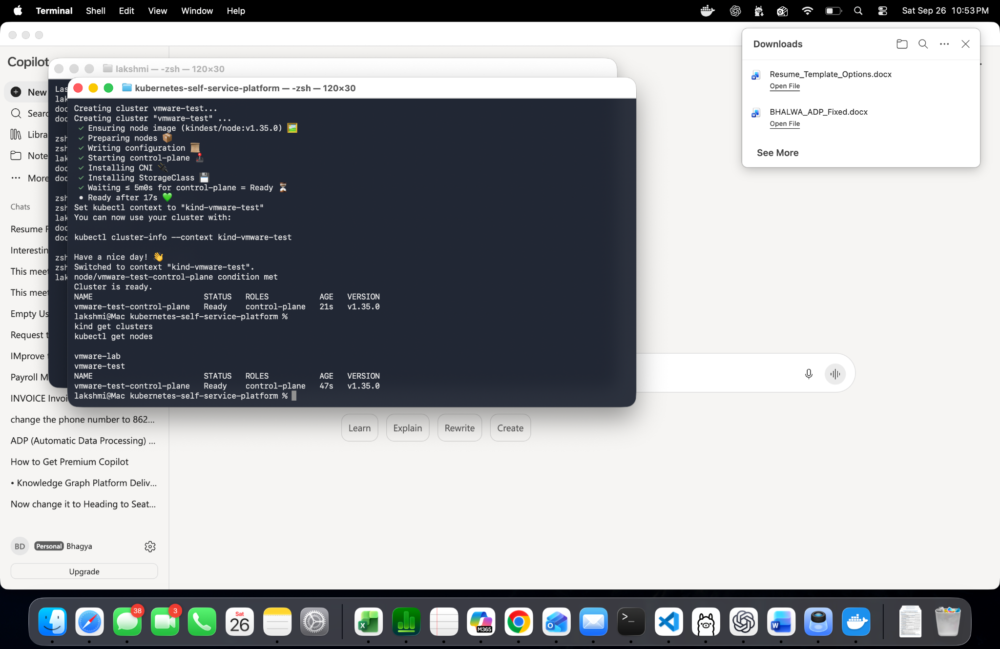

## Experiment: Automated Cluster Provisioning

**Objective:** Validate that our provisioning script
can create a new Kubernetes cluster without affecting
an existing cluster.

**Command:**

    ./scripts/provision-cluster.sh vmware-test

**Results:**

- Successfully created the vmware-test cluster.
- Provisioning completed in approximately 17 seconds.
- The control-plane node reached Ready status.
- Kubernetes version: v1.35.0.
- The existing vmware-lab cluster remained available.
- Kubernetes context switched to kind-vmware-test.

**Evidence:**

**Status:** PASS
