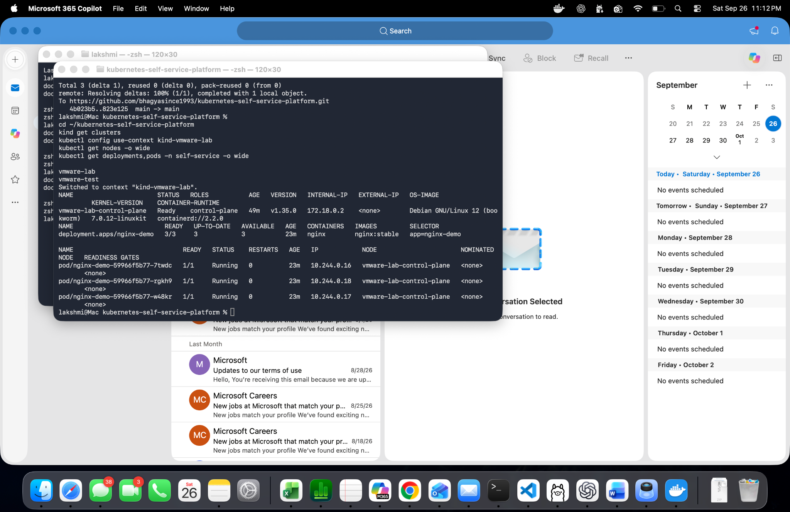
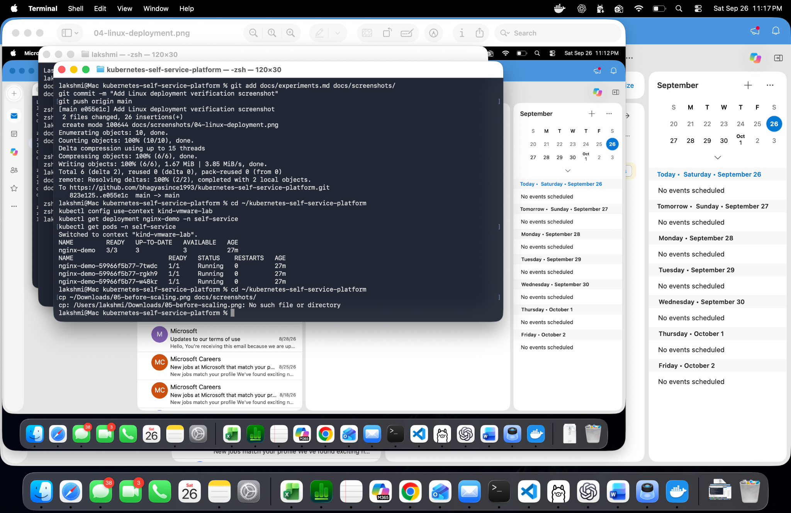
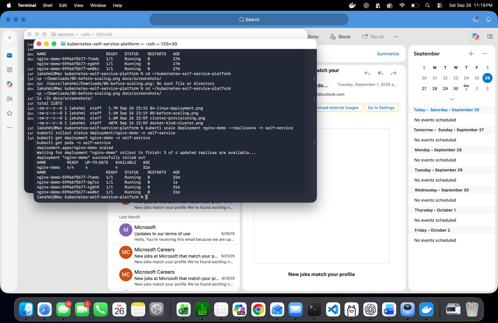

## Experiment: Automated Cluster Provisioning

**Objective:** Validate that our provisioning script
can create a new Kubernetes cluster without affecting
an existing cluster.

**Command:**

    ./scripts/provision-cluster.sh vmware-test

**Results:**

- Successfully created the vmware-test cluster.
- Provisioning completed in approximately 17 seconds.
- The control-plane node reached Ready status.
- Kubernetes version: v1.35.0.
- The existing vmware-lab cluster remained available.
- Kubernetes context switched to kind-vmware-test.

**Evidence:**

**Status:** PASS

---

## Experiment 04: Linux Deployment Verification

**Objective:** Verify Kubernetes cluster availability and confirm all NGINX replicas are healthy.

**Commands:**

    kind get clusters
    kubectl config use-context kind-vmware-lab
    kubectl get nodes -o wide
    kubectl get deployments,pods -n self-service -o wide

**Observed results:**
- Two clusters: vmware-lab and vmware-test.
- Kubernetes version: v1.35.0.
- NGINX deployment: 3/3 ready replicas.
- Three Pods running with zero restarts.
- Container image: nginx:stable.

**Screenshot:**

**Result: PASS**

---

## Experiment 05: Linux Workload Scaling

**Objective:** Scale NGINX from three to four replicas
and verify successful rollout.

**Cluster:** vmware-lab

**Command:**

    kubectl scale deployment nginx-demo --replicas=4 -n self-service
    kubectl rollout status deployment/nginx-demo -n self-service
    kubectl get deployment nginx-demo -n self-service
    kubectl get pods -n self-service

### Before Scaling

### After Scaling

### Results

| Metric | Before | After |
|---|---:|---:|
| Desired replicas | 3 | 4 |
| Ready replicas | 3 | 4 |
| Running Pods | 3 | 4 |
| Pod restarts | 0 | 0 |

**Status: PASS**

Kubernetes successfully scaled the deployment
from three to four replicas. All four Pods were
running after the rollout.
