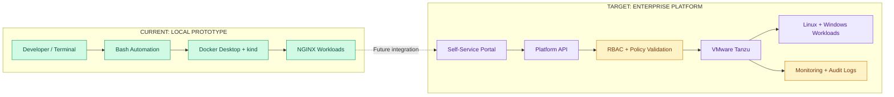
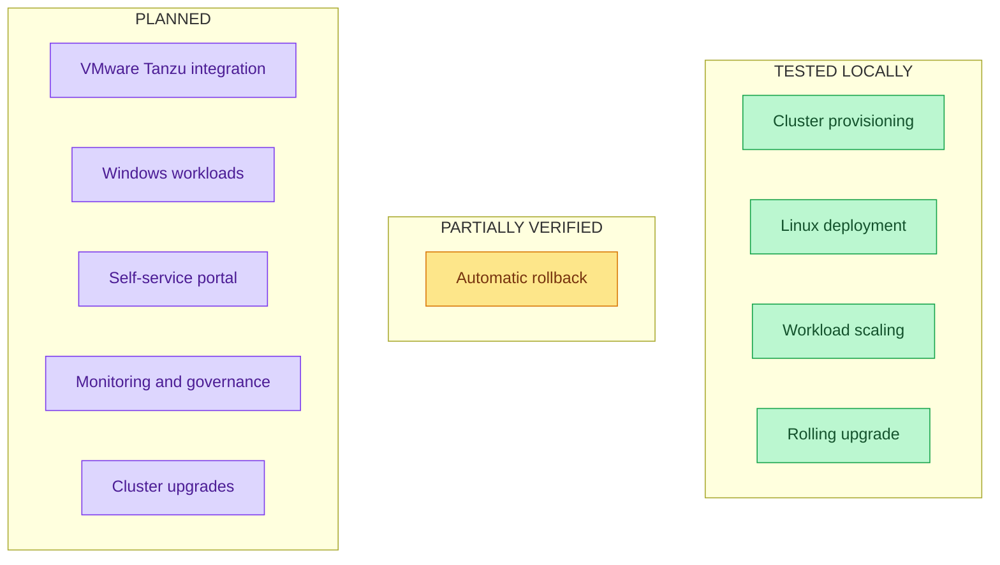

# Kubernetes Self-Service Platform: Gap Analysis

## Objective

Compare our tested local Kubernetes prototype with
the planned VMware Tanzu self-service platform.

## 1. Current vs. Target Architecture

## 2. Capability Gap Analysis

| Capability | Current State | Target State | Gap |
|---|---|---|---|
| Cluster provisioning | Local kind automation tested | Tanzu provisioning | VMware integration |
| Linux workloads | NGINX deployment tested | Reusable deployment templates | Configuration |
| Scaling | Manual replica scaling tested | Policy-based autoscaling | HPA |
| Upgrades | Rolling application upgrade tested | Automated release lifecycle | CI/CD |
| Recovery | Previous image restored | Verified automated rollback | Final script logs |
| Cluster upgrades | Not tested | Controlled Kubernetes upgrades | Implementation |
| Windows workloads | Not tested | Windows node support | Compatible infrastructure |
| Self-service UI | Not implemented | User-facing request portal | UI and APIs |
| Monitoring | Basic kubectl checks | Dashboards and alerts | Observability |
| Governance | Not implemented | RBAC, policies and audit | Security controls |

## 3. Capability Status

Green = tested locally.
Amber = partially verified.
Purple = planned.

These categories describe verification status,
not measured completion percentages.

## 4. Prioritized Implementation Roadmap

### Phase 1: Complete Local Automation

- Confirm automatic rollback execution.
- Implement safe cluster deletion.
- Test cluster creation and deletion.
- Add script error handling.
- Capture screenshots for every experiment.

### Phase 2: Improve Reliability

- Add configurable deployment templates.
- Introduce automated YAML validation.
- Implement workload health checks.
- Add CI testing and deployment workflows.

### Phase 3: VMware Tanzu Integration

- Confirm access to a compatible VMware environment.
- Evaluate Tanzu product and version.
- Implement Tanzu cluster provisioning.
- Test worker-node scaling and cluster upgrades.
- Add access controls and audit logging.

### Phase 4: Self-Service Platform

- Develop a request portal.
- Build lifecycle management APIs.
- Introduce approval and policy workflows.
- Add monitoring dashboards.
- Validate Linux and Windows workloads.

## 5. Proposed Product KPIs

| Metric | Purpose |
|---|---|
| Provisioning lead time | Measure time to create a cluster |
| Deployment success rate | Track workload reliability |
| Upgrade success rate | Evaluate release stability |
| Recovery time | Measure failure recovery |
| Manual steps per deployment | Quantify automation |
| Self-service adoption | Measure platform usage |

Baseline and target values must be established
through actual testing. No performance improvements
are claimed without measured evidence.
