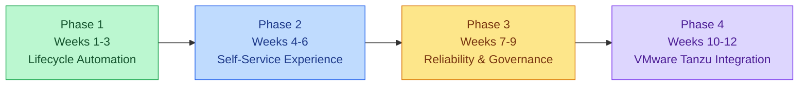
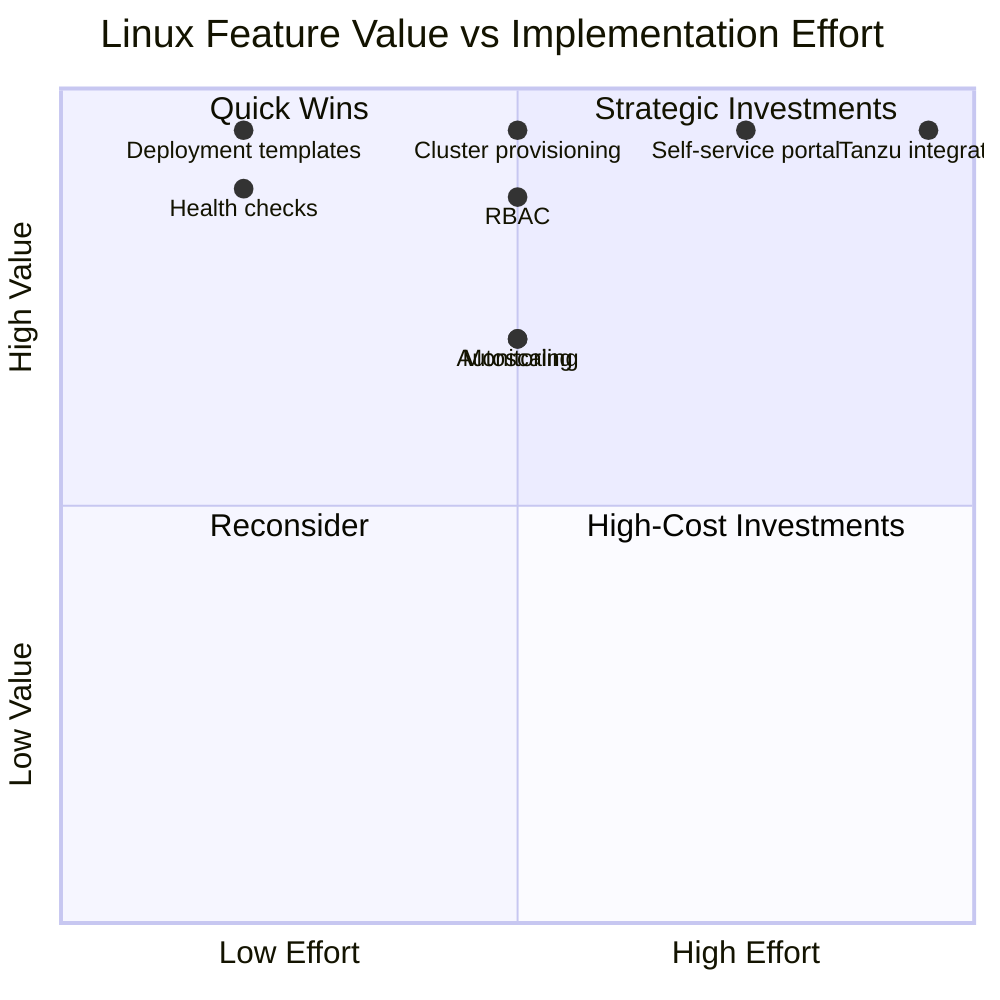

# Linux Kubernetes Roadmap & BVI Prioritization

## Product Vision

Provide a standardized self-service platform for
provisioning and managing Linux Kubernetes environments,
reducing manual infrastructure operations and improving
developer experience.

## Problem Statement

Manual Kubernetes environment setup introduces
repetitive work, configuration inconsistencies and
operational dependencies on platform engineers.

A self-service platform aims to standardize cluster
provisioning and application lifecycle management.

## Current Prototype

Tested locally:
- kind cluster provisioning
- Existing-cluster detection
- Linux NGINX deployment
- Workload replica scaling
- Rolling application upgrades
- Recovery to the previous application image

Automatic rollback execution requires final log
confirmation.

VMware Tanzu provisioning has not yet been tested.

## Proposed 12-Week Roadmap

### Phase 1: Lifecycle Automation

- Linux deployment templates
- Cluster provisioning scripts
- Workload scaling
- Rolling upgrades
- Rollback verification
- Safe cleanup
- Automated script testing

### Phase 2: Self-Service Experience

- Request API
- Basic developer portal
- Standard Linux environment templates
- Resource quotas
- Configuration validation
- GitHub Actions CI

### Phase 3: Reliability & Governance

- Kubernetes RBAC
- Health checks
- Prometheus and Grafana
- Horizontal Pod Autoscaler
- Audit logging
- Failure recovery testing

### Phase 4: VMware Tanzu Integration

- Validate VMware prerequisites
- Implement supported Tanzu APIs
- Linux cluster configuration templates
- Cluster upgrade testing
- Worker-node scaling
- End-to-end pilot

## BVI Prioritization

This is an illustrative scoring exercise.
Scores are assumptions, not validated customer data.

Formula:

BVI = ((0.40 * Customer Impact)
     + (0.35 * Business Impact)
     + (0.25 * Strategic Alignment))
     * 20 / Implementation Effort

Each input is scored from 1 to 5.

| Feature | Customer | Business | Strategic | Effort | BVI |
|---|---:|---:|---:|---:|---:|
| Linux deployment templates | 5 | 5 | 5 | 2 | 50.0 |
| Health checks and rollback | 5 | 4 | 5 | 2 | 46.5 |
| Automated cluster provisioning | 5 | 5 | 5 | 3 | 33.3 |
| RBAC and policy controls | 4 | 5 | 5 | 3 | 30.7 |
| Monitoring dashboards | 4 | 4 | 4 | 3 | 26.7 |
| Horizontal autoscaling | 4 | 4 | 4 | 3 | 26.7 |
| Self-service portal | 5 | 5 | 5 | 4 | 25.0 |
| Tanzu integration | 5 | 5 | 5 | 5 | 20.0 |

## Prioritization Visualization

The chart is a conceptual visualization of
illustrative feature assessments.

## Dependencies and Trade-offs

- Basic deployment automation precedes the portal.
- Identity and authorization must be designed before
  exposing shared enterprise environments.
- Tanzu integration requires access to a compatible
  VMware environment.
- Windows support is a separate workstream.
- Production monitoring and rollback testing are
  prerequisites for a reliable enterprise pilot.

## Proposed Success Metrics

- Time to provision a Linux environment
- Percentage of successful deployments
- Number of manual provisioning steps
- Mean time to recover from failed upgrades
- Percentage of requests completed self-service
- Platform adoption across engineering teams

Actual baselines and targets remain to be measured.
