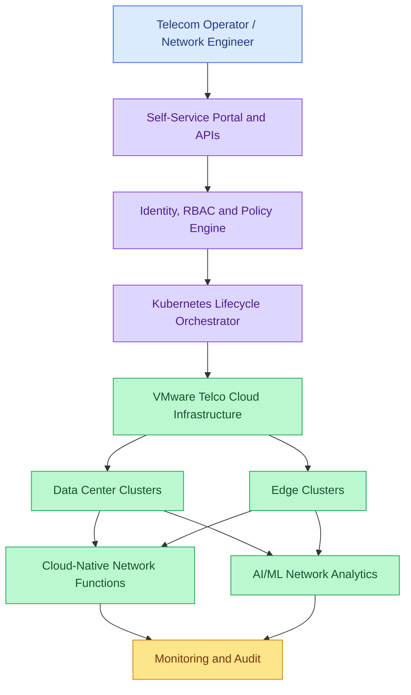

# Product Requirements Document
## Telco Cloud: Kubernetes Infrastructure and Network Workloads

**Product Owner:** Bhagyalakshmi Duraisamy
**Status:** Proposed portfolio product
**Target Platform:** VMware Telco Cloud / Kubernetes
**Scope:** Cloud-native telecom infrastructure

---

## 1. Product Vision

Enable telecommunications operators to deploy,
scale and manage cloud-native network functions
across data centers and edge environments using
standardized Kubernetes infrastructure.

## 2. Problem Statement

Telecommunications operators manage distributed
infrastructure supporting network functions and
latency-sensitive services.

Manual provisioning, inconsistent configurations
and fragmented lifecycle management can increase
operational complexity.

The proposed platform will standardize workload
deployment, infrastructure operations and
observability.

## 3. Target Customers and Personas

| Persona | Primary Need |
|---|---|
| Telecom operator | Manage distributed network infrastructure |
| Network engineer | Deploy and operate network functions |
| Platform engineer | Standardize Kubernetes infrastructure |
| SRE | Maintain service reliability |
| Security administrator | Enforce network and access policies |
| AI/ML engineer | Deploy network analytics workloads |

## 4. Product Goals

- Standardize cloud-native network function deployment.
- Automate Kubernetes workload lifecycle management.
- Support geographically distributed edge environments.
- Improve infrastructure observability.
- Enable controlled upgrades and recovery.
- Support AI/ML-based network analytics.

## 5. Key Use Cases

### UC-01: Cloud-Native Network Function Deployment

Deploy containerized network functions using
standardized Kubernetes configurations.

### UC-02: Edge Workload Orchestration

Deploy and manage latency-sensitive workloads
across supported edge locations.

### UC-03: AI-Based Network Anomaly Detection

Analyze network telemetry to identify unusual
traffic patterns and operational anomalies.

### UC-04: Predictive Infrastructure Maintenance

Use historical incidents and infrastructure
telemetry to support proactive maintenance.

### UC-05: Intelligent Capacity Management

Analyze utilization and traffic demand to
inform capacity planning and scaling decisions.

## 6. Functional Requirements

| ID | Requirement | Acceptance Criteria |
|---|---|---|
| TEL-01 | Workload provisioning | Deploy supported network functions from validated templates |
| TEL-02 | Lifecycle management | Support controlled deployment, upgrade and rollback |
| TEL-03 | Edge orchestration | Deploy workloads to selected supported edge locations |
| TEL-04 | Resource management | Enforce CPU, memory and workload-specific resource policies |
| TEL-05 | Observability | Collect infrastructure and application telemetry |
| TEL-06 | Resilience | Validate recovery from defined failure scenarios |
| TEL-07 | Security | Enforce RBAC, network policies and audit logging |
| TEL-08 | AI/ML workloads | Support deployment of network analytics services |
| TEL-09 | Capacity management | Expose utilization metrics and scaling recommendations |

## 7. User Stories

### US-01: Network Function Deployment

As a network engineer, I want to deploy a
supported cloud-native network function using
a validated template so that configurations
remain consistent across environments.

Acceptance criteria:
- Validate deployment parameters.
- Check infrastructure prerequisites.
- Deploy to the selected cluster.
- Verify workload readiness.
- Report deployment status.

### US-02: Edge Deployment

As a telecom operator, I want to deploy
latency-sensitive workloads to an appropriate
edge location.

Acceptance criteria:
- Select an authorized edge location.
- Validate available capacity.
- Apply workload placement requirements.
- Report deployment health.

### US-03: Controlled Upgrades

As an SRE, I want controlled workload upgrades
with documented recovery procedures.

Acceptance criteria:
- Validate upgrade prerequisites.
- Execute a controlled rollout.
- Detect unsuccessful deployments.
- Execute and verify recovery.
- Record the final workload state.

### US-04: Network Anomaly Detection

As a network operations engineer, I want
network telemetry analyzed for anomalies
so that I can investigate potential issues.

Acceptance criteria:
- Ingest supported telemetry.
- Identify anomalies against a defined baseline.
- Present supporting evidence.
- Allow engineers to review alerts.
- Measure false-positive rates.

### US-05: Infrastructure Governance

As a security administrator, I want
consistent access and network policies
across managed environments.

Acceptance criteria:
- Enforce role-based permissions.
- Validate network policies.
- Record privileged operations.
- Report policy violations.

## 8. Non-Functional Requirements

### Availability

Define service-level objectives for each
supported network workload.

### Performance

Validate workload-specific latency,
throughput and resource requirements.

### Scalability

Support horizontal scaling where permitted
by workload architecture.

### Security

Apply least-privilege access, network
segmentation and approved image policies.

### Resilience

Test node failures, workload failures
and supported recovery scenarios.

### Observability

Provide centralized metrics, logs,
traces where supported, and alerts.

## 9. Proposed Architecture

This is a proposed logical architecture,
not a deployed VMware environment.

## 10. Proposed Release Roadmap

### Phase 1: Platform Foundation

- Infrastructure prerequisites
- Kubernetes workload templates
- Deployment and lifecycle automation
- Initial operational metrics

### Phase 2: Carrier-Grade Operations

- Access and network policies
- Controlled upgrades
- Failure recovery testing
- Centralized observability

### Phase 3: Edge Orchestration

- Edge environment configuration
- Workload placement policies
- Distributed monitoring
- Edge failure recovery

### Phase 4: AI-Enabled Operations

- Network telemetry ingestion
- Anomaly detection
- Capacity analytics
- Operational recommendations

## 11. Dependencies

- Access to a compatible VMware environment
- Supported Kubernetes and Telco Cloud versions
- Network function vendor compatibility
- Defined latency and availability requirements
- Security and compliance review
- Representative telecom test workloads

## 12. Proposed Success Metrics

| KPI | Measurement |
|---|---|
| Provisioning lead time | Request to ready workload |
| Deployment success | Successful / total deployments |
| Upgrade success | Successful / total upgrades |
| Recovery time | Detection to restored service |
| Service availability | Performance against agreed SLO |
| Edge deployment consistency | Successful standardized deployments |
| Anomaly precision | Confirmed anomalies / generated alerts |
| Infrastructure utilization | Resource consumption over time |

Actual baselines and targets require
customer discovery and controlled testing.

## 13. Risks and Mitigations

| Risk | Proposed Mitigation |
|---|---|
| Infrastructure incompatibility | Validate supported VMware configurations |
| Network function incompatibility | Test representative vendor workloads |
| Service interruption | Stage upgrades and test recovery |
| Edge connectivity failures | Define disconnected-operation behavior |
| AI false positives | Require evaluation and human review |
| Security misconfiguration | Automate policy validation |

## 14. Out of Scope for Initial Release

- Autonomous network changes without approval
- Guaranteed latency across all network conditions
- Support for every network function vendor
- Production deployment without carrier validation
- Windows workload orchestration

## 15. Relationship to Linux Kubernetes Prototype

The existing Linux Kubernetes prototype
demonstrates local cluster provisioning,
Linux workload deployment, scaling and
successful rolling upgrades.

This Telco Cloud PRD extends those concepts
into a proposed telecom infrastructure product.

No production Telco Cloud deployment or
carrier-grade performance is claimed.
